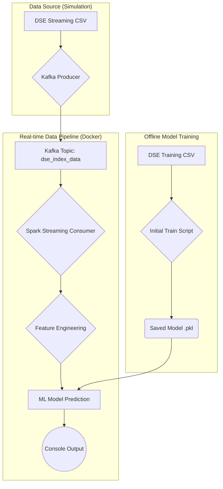

# Real-Time DSE Analytics: An MLOps Data Engineering Platform

This project implements an end-to-end, real-time MLOps data engineering platform to analyze and predict trends in the Dhaka Stock Exchange (DSE). It demonstrates a complete, job-ready skill set in data streaming, big data processing, machine learning, and containerization.

## 🌟 Key Features

-   **Real-time Data Pipeline**: Ingests live stock data using **Apache Kafka** and processes it in real-time with **Apache Spark Streaming**.
-   **Machine Learning Integration**: Uses a **Logistic Regression** model trained on historical data to make live predictions on the DSE index.
-   **Containerized Environment**: The entire platform runs in **Docker** containers, managed by **Docker Compose** for easy setup and scalability.
-   **Custom Spark Environment**: A custom Docker image ensures a consistent and reproducible Python environment for both model training and inference.
-   **Robust & Scalable**: Designed with production principles like service health checks, version-pinned dependencies, and robust error handling.

## 🏛️ Architecture

The following diagram illustrates the real-time data flow and core components of the platform:



## 🛠️ Tech Stack

-   **Data Streaming**: Apache Kafka
-   **Data Processing**: Apache Spark
-   **Machine Learning**: Scikit-learn, Pandas, Numpy
-   **Containerization**: Docker, Docker Compose
-   **Orchestration (Next Phase)**: Apache Airflow
-   **ML Experiment Tracking (Next Phase)**: MLflow
-   **Dashboard (Next Phase)**: Streamlit, PostgreSQL

## 🚀 Getting Started

### Prerequisites

-   Docker
-   Docker Compose (usually included with Docker)
-   Git

### 1. Clone the Repository

### 2. Build and Start the Docker Services

This command will build the custom Spark image with all necessary Python dependencies and start the Zookeeper, Kafka, and Spark Master/Worker containers.

```bash
docker compose up -d --build
```
*Note: The first build will take a few minutes.*

### 3. Run the Real-time Pipeline

The pipeline requires two components running in separate terminals: the **Kafka Producer** and the **Spark Consumer**.

**Terminal 1: Start the Kafka Producer**
This script simulates a live data stream by reading from `dse_streaming.csv` and sending it to a Kafka topic.

```bash
python src/kafka_producer.py
```

**Terminal 2: Start the Spark Streaming Consumer**
This Spark job connects to the Kafka stream, processes the data, and makes real-time predictions.

```bash
docker compose exec spark-master spark-submit \
  --packages org.apache.spark:spark-sql-kafka-0-10_2.12:3.3.0 \
  /app/src/spark_streaming_consumer.py
```

### 4. See the Results!

You will now see real-time predictions being printed to the console in Terminal 2, like this:

```
--- Prediction Result ---
                  Date    Price  prediction  probability_0  probability_1
0  2024-12-02 00:00:00  5201.94           1       0.480773       0.519227
```

## 📝 Project Structure

-   `data/`: Contains the raw, training, and simulation datasets.
-   `src/`: All Python source code.
    -   `initial_train.py`: Script for offline model training.
    -   `kafka_producer.py`: Simulates the real-time data stream.
    -   `spark_streaming_consumer.py`: The core Spark streaming and prediction job.
-   `docker-compose.yml`: Defines and configures all the services (Kafka, Spark, etc.).
-   `Dockerfile`: Creates the custom Spark environment with necessary libraries.
-   `requirements.txt`: Pinned Python dependencies for a reproducible environment.
-   `documents/`: Project planning and tracking files (`ACTION_PLAN.md`, `WORKDONE.md`). 